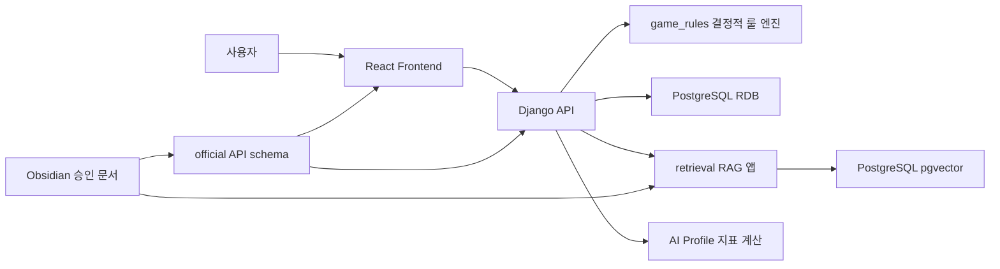
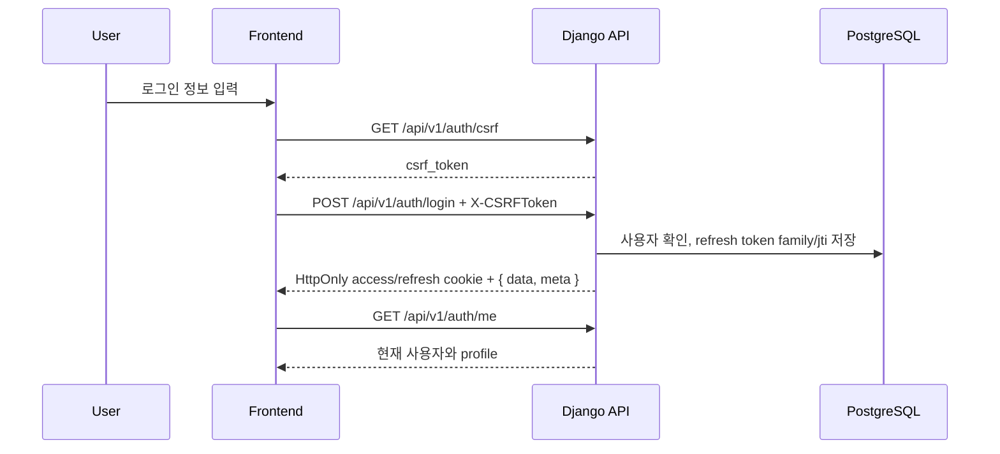
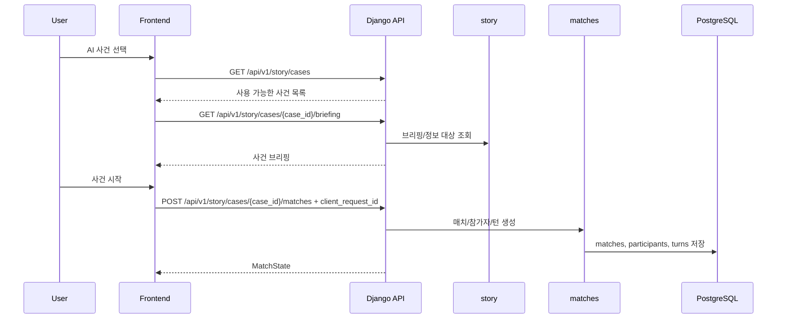
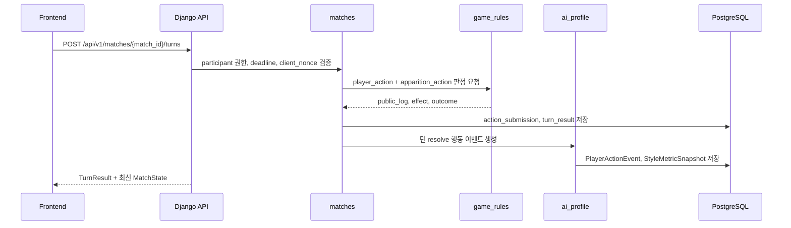
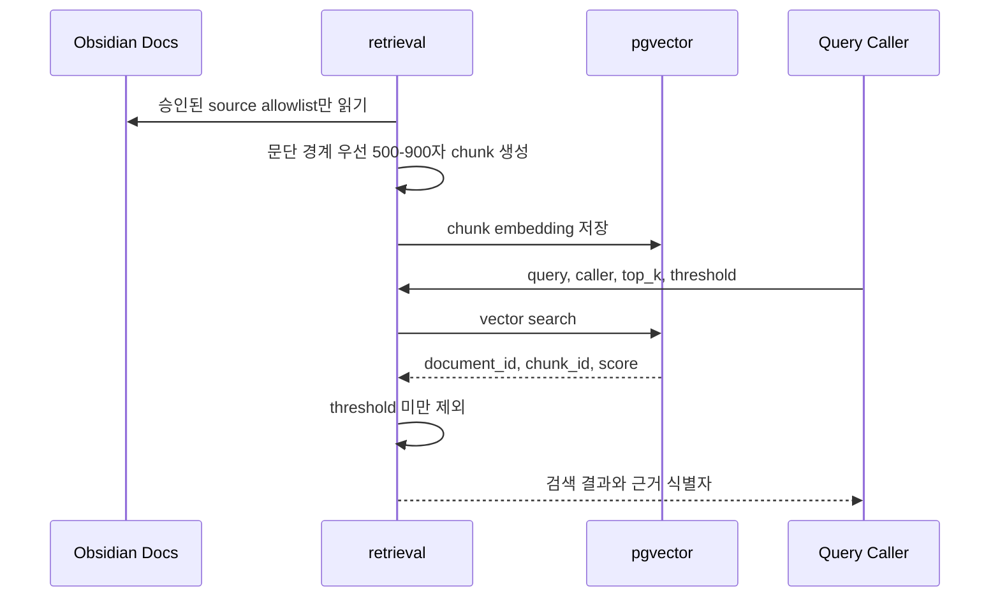

# SKN27-4th-3team

초자연 공포 스릴러 미스터리 기반 1대1 턴제 심리전 웹 게임 MVP 프로젝트입니다. 플레이어는 첫 괴이 `거울 속의 손님`과 의식 결투를 진행하며, 서버가 턴 판정과 승패를 최종 결정합니다.

## 문서 기준

이 프로젝트의 기획과 구현 기준은 `docs/`의 Obsidian 문서로 관리합니다.

| 구분 | 위치 | 역할 |
|---|---|---|
| 문서 인덱스 | [`docs/00_Index.md`](docs/00_Index.md) | 전체 Obsidian 문서 진입점 |
| 문서 운영 규칙 | [`docs/00_Project/00_문서_운영_규칙.md`](docs/00_Project/00_%EB%AC%B8%EC%84%9C_%EC%9A%B4%EC%98%81_%EA%B7%9C%EC%B9%99.md) | source of truth, 문서 상태, 미정 항목 관리 기준 |
| 프로젝트 개요 | [`docs/00_Project/01_프로젝트_개요.md`](docs/00_Project/01_%ED%94%84%EB%A1%9C%EC%A0%9D%ED%8A%B8_%EA%B0%9C%EC%9A%94.md) | 제품 방향과 기술 방향 |
| MVP 범위 | [`docs/01_MVP/02_MVP_포함_제외_범위.md`](docs/01_MVP/02_MVP_%ED%8F%AC%ED%95%A8_%EC%A0%9C%EC%99%B8_%EB%B2%94%EC%9C%84.md) | 1차 MVP 포함/제외 범위 |
| 승인 계약 | [`docs/09_Approved_Contracts/`](docs/09_Approved_Contracts) | 구현 기준으로 사용할 승인 문서 |
| 공식 API 스키마 | [`api-spec/pilot-mvp-api.official.jsonc`](api-spec/pilot-mvp-api.official.jsonc) | 사람이 읽는 공식 API 계약 |
| 도구용 API 스키마 | [`api-spec/pilot-mvp-api.official.json`](api-spec/pilot-mvp-api.official.json) | strict JSON 생성본 |

문서 운영 원칙은 다음과 같습니다.

- `draft` 문서는 구현 기준으로 단독 사용하지 않습니다.
- `needs-decision` 문서는 미정 항목을 숨기지 않고 보류합니다.
- `approved`, `implementation-ready`, official API schema만 구현 기준으로 사용합니다.
- 문서에 없는 기본값, 테이블, 상태값, seed 데이터는 임의로 만들지 않습니다.

## 기술 스택

| 영역 | 사용 기술 | 현재 범위 |
|---|---|---|
| Backend | Django, Django REST Framework, ASGI/WSGI | 1차 MVP 백엔드 scaffold와 도메인 골격 |
| Auth | Django custom user, JWT access/refresh token, HttpOnly cookie, CSRF | 인증 API scaffold와 refresh token 보안 모델 |
| RDB | PostgreSQL 기준 Django model | Auth, Profile, Match, Story, AI Profile 저장 구조 |
| VectorDB | PostgreSQL + `pgvector` | RAG chunk embedding 저장 준비 |
| RAG | `retrieval` 앱, 문서 chunk, embedding, query log | 검색 구조와 근거 로그 준비 |
| Frontend | React, TypeScript, Vite, React Router, CSS Modules | 승인 계약 존재, 실제 프론트 구현은 별도 범위 |
| Realtime/PvP | Redis, Django Channels, WebSocket | 1차 MVP 제외, 구조만 PvP-ready로 보존 |
| LLM | LLM adapter, prompt/generation | 1차 MVP 실제 생성 제외 |
| KAG/Graph | RDB 기반 knowledge graph 후보 | 1차 MVP 제외 |

## MVP 범위

### 포함

- 회원가입, 로그인, 로그아웃, 기본 프로필
- AI 사건 선택
- `거울 속의 손님` 브리핑과 의식 결투
- 턴 제출, 서버 판정, 턴 결과 저장
- 승패 처리, 결과/로그 표시
- 행동 이벤트 저장과 스타일 지표 계산
- RAG 검색용 `retrieval` 앱 구조
- RAG 문서 chunk 저장, query log 저장
- PostgreSQL `pgvector` 기반 검색 준비
- PvP-ready Auth/Match/Participant/Turn 구조 보존

### 제외

- `우물 밑의 목소리`, `문밖의 어머니` 구현
- 실시간 PvP, 매칭 대기열, WebSocket 대전
- KAG 구현과 GraphDB 전용 저장소
- 실제 LLM 생성
- 랭크 시스템, cosmetic 보상
- 운영 배포 자동화

## 시스템 구조

프로젝트는 Monorepo + 팀별 경계 분리 구조를 기준으로 합니다.

```text
backend/   Django API, DB 모델, 서버 판정, Auth, RAG, AI Profile
frontend/  React + TypeScript + Vite 프론트 구현 기준
llm/       prompt, generation 정책, provider 실험 기준
api-spec/  공식 API schema와 draft 명세
docs/      Obsidian 승인 문서, 설계 문서, 후순위 문서
tools/     문서 생성, 검증, 개발 보조 스크립트 후보
output/    문서/이미지/PDF 산출물
ops/       Docker Compose, env template, 운영 후보
```

현재 저장소에는 백엔드와 문서/API 계약 중심의 구현 scaffold가 생성되어 있습니다.



핵심 원칙은 서버 권위입니다. LLM, RAG, KAG는 룰 판정, 승패, 인증/권한, 진명 조각, 거짓 단서, 괴이 행동 선택을 바꾸지 않습니다.

## 주요 서비스 흐름

### 인증 흐름



### AI 스토리 매치 시작



### 턴 제출과 판정



### RAG 색인과 검색



## RAG 환각 방지와 출처 정책

RAG는 1차 MVP에서 판정 권위가 아니라 검색과 근거 로그를 담당합니다.

### 환각 방지 기준

- 검색 대상은 승인된 문서로 제한합니다.
- 기본 포함 대상은 `docs/09_Approved_Contracts`, `docs/05_Story_Mode/02_거울_속의_손님.md`, 승인된 게임 룰 문서입니다.
- 결정 전 검토안, deferred 문서, LLM draft/prompt 초안은 기본 제외합니다.
- RAG 결과로 행동 상성표, 승패, 진명 조각 reveal condition, 거짓 단서 trigger condition, 괴이 행동 선택을 바꾸지 않습니다.
- 공식 설정을 RAG 결과만으로 추가하지 않습니다.
- embedding model id는 환경 설정으로 주입하고 코드에 하드코딩하지 않습니다.

### 출처 표시와 근거 로그

현재 구현 기준은 사용자 화면의 citation UI 확정보다 먼저, 검색 근거를 추적 가능하게 저장하는 것입니다.

| 항목 | 저장/관리 기준 |
|---|---|
| 문서 출처 | `source_path` |
| 문서 식별자 | `document_id` |
| chunk 식별자 | `chunk_id` |
| 검색 점수 | `score` |
| 검색 조건 | `threshold`, `top_k` |
| 호출자 | `caller` |
| 생성 시각 | `created_at` |

LLM generation log와 retrieval log 연결 방식, 최종 사용자 화면에서 출처를 어떻게 표시할지는 후속 확정 항목입니다.

## RDB 설계

RDB는 PostgreSQL을 기준으로 합니다. 핵심 도메인은 정규화하고, JSONField는 결과 스냅샷, 공개/비공개 로그 스냅샷, 룰/정책 스냅샷, 괴이별 조건 같은 작은 정책 데이터로 제한합니다.

### 인증/프로필

| 테이블/모델 | 주요 필드 | 목적 |
|---|---|---|
| `accounts.User` | email, is_active, is_staff, created_at | 인증과 권한 |
| `accounts.RefreshToken` | user_id, jti, family_id, token_hash, status, issued/expires/rotated/revoked/reused | refresh token rotation/reuse 감지 |
| `accounts.SecurityEvent` | event_type, created_at | 보안 이벤트 기록 |
| `profiles.Profile` | user, nickname, 전적 요약, style 표시 필드 | 프로필과 공개 요약 |

### 매치/턴

| 테이블 | 주요 필드 | 목적 |
|---|---|---|
| `matches` | mode, status, winner_participant_id, started_at, ended_at | AI/PvP 공통 매치 |
| `match_participants` | match_id, participant_type, user_id, apparition_id, side, 자원 수치 | human/apparition 참가자 |
| `turns` | match_id, turn_number, status, deadline_at, resolved_at | 턴 상태 |
| `action_submissions` | turn_id, participant_id, action_code, info_target_key, submitted_at, client_nonce | 행동 제출과 중복 방지 |
| `turn_results` | turn_id, result_json, public_log_json, private_log_json, schema_version | 결과/로그 스냅샷 |

### 스토리

| 테이블 | 주요 필드 | 목적 |
|---|---|---|
| `story_cases` | title, summary, difficulty, status | 사건 |
| `apparitions` | name, category, description, taboo, base_policy_json | 괴이 |
| `stages` | case_id, apparition_id, order, victory_condition_json | 스테이지 |
| `true_name_fragments` | apparition_id, label, content, reveal_condition_json | 진명 조각 |
| `false_clues` | apparition_id, content, trigger_condition_json | 거짓 단서 |
| `player_story_progress` | user_id, stage_id, status, attempts, completed_at | 사용자 진행도 |

### AI Profile

| 테이블/모델 | 주요 필드 | 목적 |
|---|---|---|
| `PlayerActionEvent` | user_id, match_id, stage_id, turn_number, action_code, info_target_key, decision_duration_ms, 자원 스냅샷, opponent_action_code, result_code, clue/outcome | 턴 resolve 시점 행동 이벤트 |
| `StyleMetricSnapshot` | aggression, defense, insight_focus, deception, risk_preference, silence_reliance, crisis_guard_rate, crisis_contract_rate, late_choice_rate | 스타일 지표 스냅샷 |

## GraphDB/KAG 설계 상태

현재 1차 MVP에서는 별도 GraphDB를 사용하지 않습니다.

문서상 KAG는 세계관 관계를 명시적으로 관리하는 지식 그래프이며, 후순위 설계로 보존됩니다. 후보 구조는 `knowledge_nodes`, `knowledge_edges`, `node_type`, `relation_type`, RAG 검색 범위 필터링입니다.

구현 전 확정이 필요한 항목은 다음과 같습니다.

- 초기 node seed 데이터
- relation weight 의미
- KAG 관리 UI 필요 여부

## VectorDB와 문서 청킹 기준

VectorDB는 PostgreSQL + `pgvector`입니다.

| 항목 | 기준 |
|---|---|
| 저장 모델 | `RetrievalDocument`, `RetrievalChunk`, `RetrievalQueryLog` |
| chunk 크기 | 500-900자 |
| 경계 기준 | 문단 경계 우선 |
| overlap | 최대 100자 |
| 필수 메타데이터 | `document_id`, `chunk_id`, `source_path`, `schema_version` |
| 검색 기본값 | `top_k=6`, `score_threshold=0.72` |
| embedding model | 환경 설정으로 주입 |

전처리 흐름은 다음과 같습니다.

1. `source_path`를 정규화합니다.
2. 승인된 source allowlist에 포함되는지 검사합니다.
3. 문서를 빈 줄 기준 문단으로 나눕니다.
4. 문단을 900자 이하 chunk로 합칩니다.
5. 긴 문단은 900자 단위로 분할합니다.
6. chunk마다 `document_id:{index}` 형식의 `chunk_id`를 부여합니다.
7. embedding을 `pgvector` 필드에 저장할 수 있게 준비합니다.

## 수집 데이터와 전처리

### 게임 플레이 데이터

턴 resolve 시점에 행동 이벤트를 수집합니다.

- 사용자/매치/스테이지/턴 식별자
- 선택 행동과 정보 대상
- 선택 소요 시간
- 선택 당시 이성, 의식력, 저주 흔적
- 상대 행동
- 결과 코드
- 획득 단서와 단서 진위
- 매치 종료 시 승패

전처리는 스타일 지표 계산으로 수행합니다.

| 지표 | 계산 방식 |
|---|---|
| 공격성 | 저주 선택 수 / 전체 턴 수 |
| 방어성 | 수호 선택 수 / 전체 턴 수 |
| 정보 집착 | 간파 선택 수 / 전체 턴 수 |
| 기만성 | 속임수 선택 수 / 전체 턴 수 |
| 위험 선호 | 계약 선택 수 / 전체 턴 수 |
| 침묵 의존 | 침묵 선택 수 / 전체 턴 수 |
| 위기 방어율 | 이성 4 이하에서 수호 선택 수 / 위기 턴 수 |
| 위기 계약율 | 이성 4 이하에서 계약 선택 수 / 위기 턴 수 |
| 늦은 선택률 | 제한 시간 70% 이후 제출 수 / 전체 턴 수 |

분모가 0인 지표는 `0.0`으로 저장합니다.

### RAG 문서 데이터

수집 대상은 승인 문서와 공식 스토리/룰 문서입니다.

- `docs/09_Approved_Contracts/*`
- `docs/05_Story_Mode/02_거울_속의_손님.md`
- `docs/02_Game_Rules/01_자원과_상태.md`
- `docs/02_Game_Rules/04_상성_규칙.md`
- `docs/02_Game_Rules/05_승패_조건.md`
- `docs/02_Game_Rules/06_시간초과_규칙.md`
- `docs/02_Game_Rules/99_Game_Rules_구현_확정.md`

외부 데이터셋 수집은 현재 승인된 1차 MVP 범위에 없습니다.

## 화면 설계

프론트 MVP 화면 목록은 다음과 같습니다.

| 화면 | 목적 | MVP |
|---|---|---|
| 로그인 | 계정 인증 | 포함 |
| 회원가입 | 신규 계정 생성 | 포함 |
| 비밀번호 재설정 | 계정 복구 | 포함 |
| 로비 | 모드 선택 | 포함 |
| AI 사건 선택 | 스토리 모드 진입 | 포함 |
| 브리핑 | 괴이와 사건 소개 | 포함 |
| 의식 결투 | 핵심 플레이 화면 | 포함 |
| 결과 | 승패, 로그, 스타일 분석 표시 | 포함 |
| 프로필 | 전적과 기본 성향 확인 | 포함 |
| PvP 매칭 | 실시간 상대 찾기 | 제외 |

의식 결투 화면 구성 기준:

- 중앙: 괴이 또는 상대 실루엣
- 하단: 내 행동 선택 패널
- 좌측: 내 이성, 의식력, 저주 흔적
- 우측: 상대 공개 상태
- 상단: 턴 번호와 제한 시간
- 중앙 하단: 이번 턴 공개 로그
- 별도 패널: 획득 단서와 의심 단서

화면 설계 참고 문서:

- [`docs/04_Frontend/01_화면_목록.md`](docs/04_Frontend/01_%ED%99%94%EB%A9%B4_%EB%AA%A9%EB%A1%9D.md)
- [`docs/04_Frontend/03_로비와_사건_선택.md`](docs/04_Frontend/03_%EB%A1%9C%EB%B9%84%EC%99%80_%EC%82%AC%EA%B1%B4_%EC%84%A0%ED%83%9D.md)
- [`docs/04_Frontend/04_의식_결투_화면.md`](docs/04_Frontend/04_%EC%9D%98%EC%8B%9D_%EA%B2%B0%ED%88%AC_%ED%99%94%EB%A9%B4.md)
- [`docs/04_Frontend/05_결과_화면.md`](docs/04_Frontend/05_%EA%B2%B0%EA%B3%BC_%ED%99%94%EB%A9%B4.md)

## 테스트 시나리오와 결과

현재 백엔드 테스트는 계약 기반 테스트를 중심으로 구성되어 있습니다.

| 영역 | 주요 검증 |
|---|---|
| config | Django 설정, 앱 경계, 의존성 계약 |
| common | API 성공/실패 envelope, error code catalog |
| accounts | custom user, profile, refresh token, auth API scaffold |
| game_rules | 7x7 상성표, 자원 상태, 승패 조건, 괴이 행동 정책 |
| matches | match/participant/turn 저장 구조, 턴 resolve |
| story | story case, apparition, stage, clue 저장 구조 |
| ai_profile | 행동 이벤트, 스타일 지표 계산 |
| retrieval | RAG 문서/chunk/embedding/query log 구조와 allowlist |

검증 결과:

```text
명령: C:\Python314\python.exe -m pytest backend\tests -v
결과: 88 passed
```

구현 리포트:

- [`docs/superpowers/reports/2026-06-04-backend-implementation-report.md`](docs/superpowers/reports/2026-06-04-backend-implementation-report.md)

## 발표 자료 구성안

발표 자료는 아래 흐름으로 구성합니다.

1. 프로젝트 개요
   - 장르: 초자연 공포 스릴러 미스터리
   - 핵심 플레이: 괴이의 진명을 파헤치는 1대1 심리전
   - 1차 MVP 대상: `거울 속의 손님`
2. 문서 기반 기획
   - Obsidian 문서 운영 규칙
   - 승인 계약과 draft 문서 분리
   - official API schema 관리
3. 시스템 아키텍처
   - React Frontend, Django API, PostgreSQL, pgvector
   - 서버 권위 룰 엔진
   - PvP-ready Match 구조
4. RDB 설계
   - Auth/Profile
   - Match/Turn/Submission/Result
   - Story/Apparition/Clue
   - AI Profile
5. RAG와 환각 방지
   - 승인 문서 allowlist
   - chunking 기준
   - query log와 출처 추적
   - RAG 결과의 판정 권한 금지
6. VectorDB 구축 기준
   - PostgreSQL + pgvector
   - 500-900자 문단 기반 chunk
   - top_k, threshold 정책
7. 주요 서비스 시퀀스
   - 인증
   - 사건 선택/매치 시작
   - 턴 제출/판정
   - RAG 검색
8. 화면 설계
   - 로그인, 로비, 사건 선택, 브리핑, 의식 결투, 결과, 프로필
9. 테스트 시나리오와 결과
   - 계약 테스트 범위
   - `88 passed`
10. 팀원별 느낀점
   - 팀원 1: 작성 필요
   - 팀원 2: 작성 필요
   - 팀원 3: 작성 필요
   - 팀원 4: 작성 필요

팀원별 느낀점은 현재 저장소 문서에 확정 내용이 없으므로 임의로 작성하지 않았습니다.

## 현재 구현 상태와 남은 리스크

현재 상태:

- 백엔드 scaffold와 도메인 모델/서비스 골격 구현
- 공식 API schema와 계약 테스트 정리
- RAG 구조, chunking, allowlist, 검색 기본값 구현 준비
- 백엔드 테스트 88개 통과

남은 리스크:

- 실제 DB migration과 PostgreSQL 연결 검증은 별도 필요합니다.
- `story/cases`, `matches`, `profile` 등 전체 official endpoint의 runtime 연결은 후속 구현 대상입니다.
- Frontend 실제 구현은 현재 저장소에 아직 없습니다.
- LLM generation, KAG, WebSocket/PvP는 1차 MVP 제외입니다.
- 사용자 화면에서 RAG 출처를 어떻게 표시할지는 후속 확정이 필요합니다.

## 주요 참고 문서

- [`docs/09_Approved_Contracts/15_프론트_기술_계약_오너_확정안.md`](docs/09_Approved_Contracts/15_%ED%94%84%EB%A1%A0%ED%8A%B8_%EA%B8%B0%EC%88%A0_%EA%B3%84%EC%95%BD_%EC%98%A4%EB%84%88_%ED%99%95%EC%A0%95%EC%95%88.md)
- [`docs/09_Approved_Contracts/17_백엔드_RAG_AI_Profile_구현_계약.md`](docs/09_Approved_Contracts/17_%EB%B0%B1%EC%97%94%EB%93%9C_RAG_AI_Profile_%EA%B5%AC%ED%98%84_%EA%B3%84%EC%95%BD.md)
- [`docs/09_Approved_Contracts/18_게임_규칙_상성표_상태_승패_계약.md`](docs/09_Approved_Contracts/18_%EA%B2%8C%EC%9E%84_%EA%B7%9C%EC%B9%99_%EC%83%81%EC%84%B1%ED%91%9C_%EC%83%81%ED%83%9C_%EC%8A%B9%ED%8C%A8_%EA%B3%84%EC%95%BD.md)
- [`docs/09_Approved_Contracts/20_Django_Auth_보안_계약.md`](docs/09_Approved_Contracts/20_Django_Auth_%EB%B3%B4%EC%95%88_%EA%B3%84%EC%95%BD.md)
- [`docs/09_Approved_Contracts/21_AI_스토리_시간초과_판정_계약.md`](docs/09_Approved_Contracts/21_AI_%EC%8A%A4%ED%86%A0%EB%A6%AC_%EC%8B%9C%EA%B0%84%EC%B4%88%EA%B3%BC_%ED%8C%90%EC%A0%95_%EA%B3%84%EC%95%BD.md)
- [`docs/09_Approved_Contracts/22_API_상세_Schema_계약.md`](docs/09_Approved_Contracts/22_API_%EC%83%81%EC%84%B8_Schema_%EA%B3%84%EC%95%BD.md)
- [`docs/09_Approved_Contracts/23_프로젝트_폴더_구조_계약.md`](docs/09_Approved_Contracts/23_%ED%94%84%EB%A1%9C%EC%A0%9D%ED%8A%B8_%ED%8F%B4%EB%8D%94_%EA%B5%AC%EC%A1%B0_%EA%B3%84%EC%95%BD.md)
