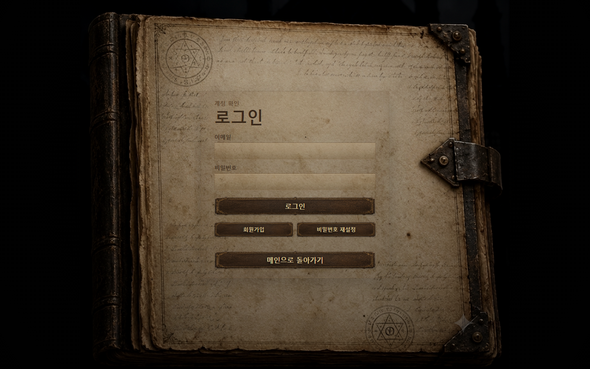
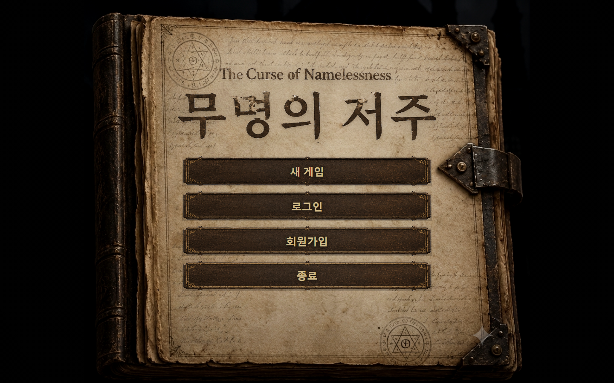
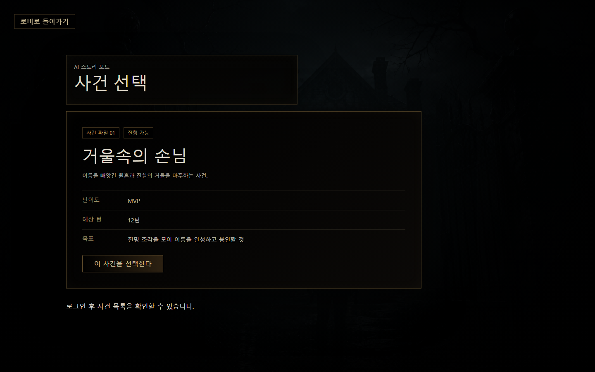
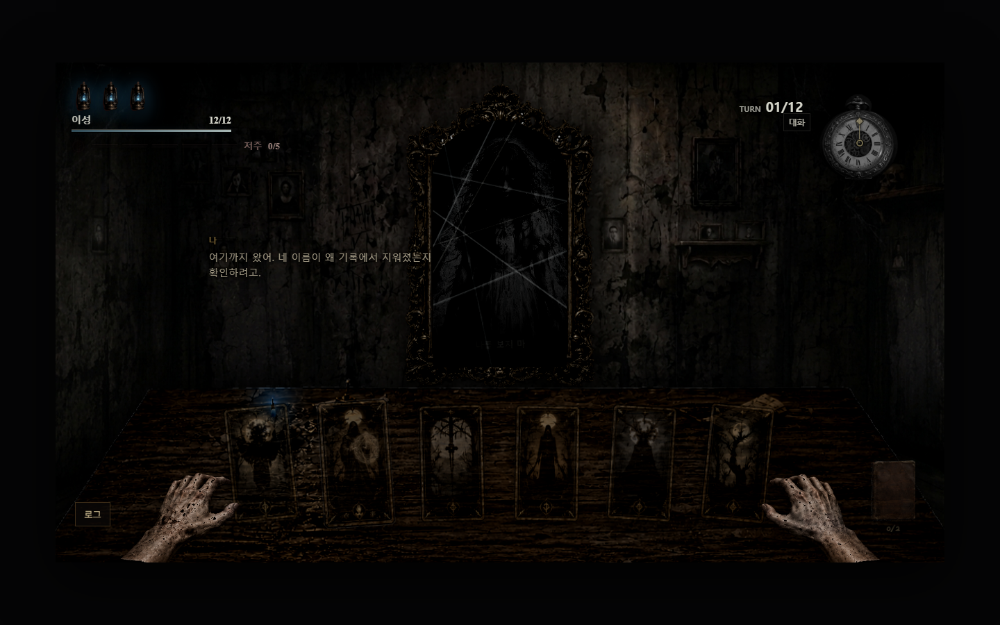
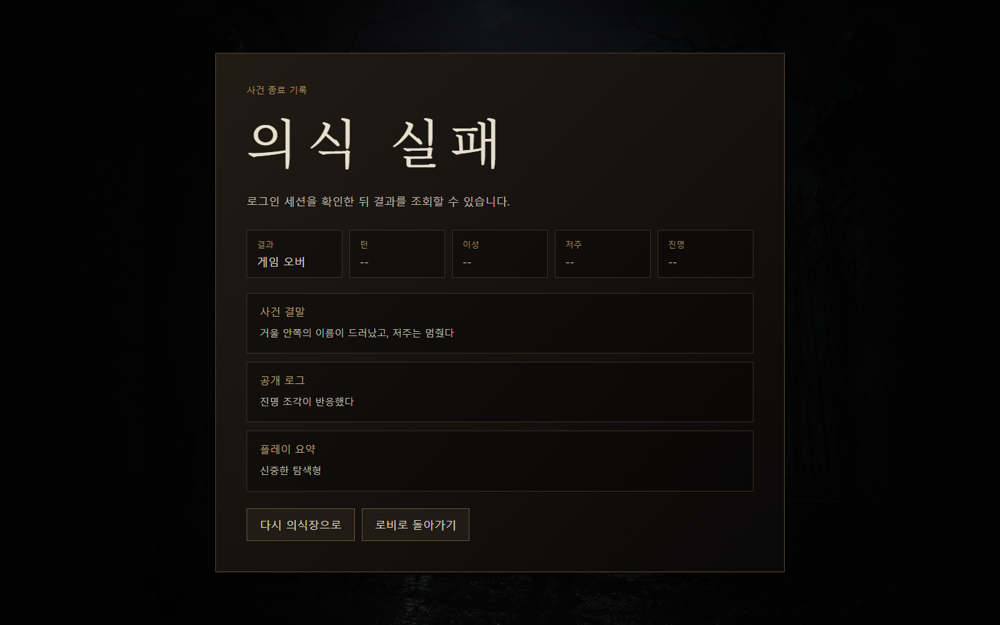
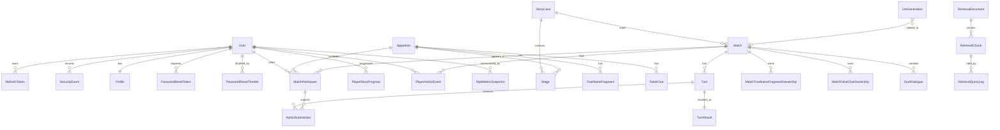
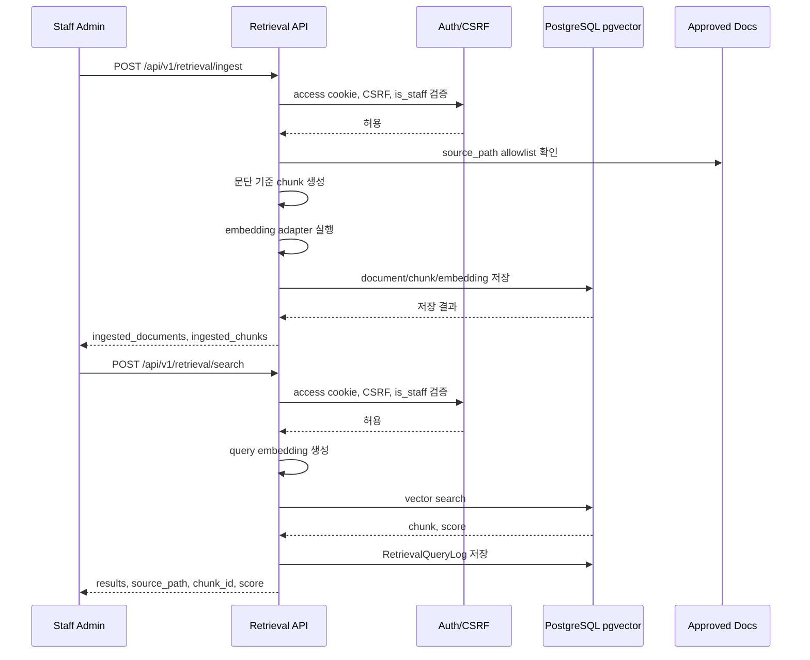

# 마지막 단위프로젝트 제출 정리

## 현재 구현 정도 요약

| 구분 | 상태 | 근거 |
|---|---|---|
| 로컬 실행 | 가능 | `.\dev-start.cmd` / `ops\scripts\dev-start.ps1 -SkipInstall`로 backend와 frontend 실행 확인 |
| 게임 화면 | 구현됨 | 로그인, 로비, 사건 선택, 프롤로그, 결투, 결과 화면 캡처 완료 |
| 백엔드 핵심 API | 구현됨 | auth, profile, story, match, turn resolve, result, WebSocket, password reset endpoint |
| 카드 룰 엔진 | 구현됨 | 7x7 상성표, 자원/상태, 승패 조건, 서버 권위 판정 |
| RAG | 부분 구현 | staff 전용 수동 ingest/search API와 service probe 확인. 서버 시작 자동 ingest는 계약상 제외 |
| LLM | 부분 구현 | Groq provider smoke check 실호출 성공. 기본 runtime은 key 누락/실패 시 fallback/disabled 정책 유지 |
| production CI/CD/registry/backup/monitoring | 제외/미증명 | 현재 저장소에 실제 운영 배포 완료 증거와 자동화 증거 없음 |
| KAG/GraphDB/PvP | 제외 | 1차 MVP 범위 아님 |

## 1. 요구사항 정의서

### 기능 요구사항

| ID | 요구사항 | 현재 반영 상태 |
|---|---|---|
| FR-01 | 사용자는 회원가입/로그인/로그아웃을 할 수 있다. | 구현 |
| FR-02 | 사용자는 로비에서 AI 스토리 모드로 진입할 수 있다. | 구현 |
| FR-03 | 사용자는 승인된 사건 목록과 브리핑을 확인할 수 있다. | 구현 |
| FR-04 | 사용자는 괴이와 턴제 카드 결투를 진행할 수 있다. | 구현 |
| FR-05 | 서버는 턴 행동, 자원, 상성, 승패를 권위 있게 판정한다. | 구현 |
| FR-06 | 사용자는 결과 화면에서 승패와 로그를 확인할 수 있다. | 구현 |
| FR-07 | 사용자는 프로필과 전적 요약을 확인할 수 있다. | 구현 |
| FR-08 | 비밀번호 재설정 요청/확인 backend endpoint를 제공한다. | 구현. 프론트 화면은 제외 |
| FR-09 | 관리자는 승인 문서를 수동 ingest하고 RAG 검색을 수행할 수 있다. | 구현. staff 전용 |
| FR-10 | 운영 검증용 LLM provider smoke check를 수행할 수 있다. | 구현 |

### 비기능 요구사항

| 구분 | 기준 | 현재 반영 상태 |
|---|---|---|
| 보안 | HttpOnly cookie, CSRF, refresh token rotation, reset token 원문 저장 금지 | 구현 |
| 판정 신뢰성 | LLM/RAG가 게임 판정을 변경하지 않음 | 구현 기준 반영 |
| 실행성 | 한 번의 명령으로 로컬 개발 서버 실행 | `.\dev-start.cmd` 제공 |
| 데이터 저장 | PostgreSQL 기반 RDB, RAG는 pgvector 준비 | 구현 |
| 실시간 보조 | Redis/Channels/WebSocket으로 매치 상태 이벤트 제공 | 구현 |
| 배포 | AC-2A 단일 VM 수동 배포 후보 구성 | 구성 있음. 실제 운영 배포 완료 증거 없음 |
| 운영 자동화 | CI/CD, image registry push, 자동 백업, monitoring/alerting | 현재 제외 |

## 2. 화면설계서

아래 이미지는 1440x900 기준으로 실제 로컬 실행 화면을 캡처한 것이다. 원본 파일은 `docs/10_Final_Project/assets/`에 있다.

### 로그인

- 목적: 이메일/비밀번호 기반 인증 진입점
- 주요 요소: 로그인 입력, 회원가입 전환, API 연결 흐름
- 구현 상태: React 화면과 backend auth API 연결

### 홈

- 목적: 서비스 첫 진입 화면
- 주요 요소: 게임 분위기, 시작 진입, 주요 내비게이션
- 구현 상태: 로컬 frontend route에서 렌더링 확인

### 로비

- 목적: 플레이 모드 선택
- 주요 요소: AI 스토리 모드 진입, 현재 이용 가능한 흐름 안내
- 구현 상태: AI 스토리 모드 중심으로 구현. PvP는 제외

### 사건 선택

- 목적: 승인된 사건 선택과 브리핑 진입
- 주요 요소: 사건 카드, 난이도, 사건 설명
- 구현 상태: `mirror_guest`, `nameless_curse` 기준 화면 렌더링 확인

### 프롤로그

- 목적: 사건 몰입과 결투 전 narrative 제공
- 주요 요소: 사건 서사 이미지, 진행/건너뛰기 버튼
- 구현 상태: 실제 실행 캡처 기준 이미지와 텍스트가 식별 가능

### 의식 결투

- 목적: 카드 선택, 자원 확인, 턴 진행
- 주요 요소: 이성, 의식력, 저주 흔적, 턴, 카드 7종, 로그 버튼
- 구현 상태: prototype 결투 화면이 로컬에서 렌더링됨. 일부 route 진입 화면은 어둡게 보일 수 있어 직접 prototype 화면도 함께 검증

### 결과

- 목적: 승패, 사건 로그, 스타일 요약 확인
- 주요 요소: 결과 상태, 사건 로그, 다음 행동 버튼
- 구현 상태: 결과 화면 렌더링 확인. 실제 게임 종료 이미지 노출 순서와 로그 노출 순서는 추가 UX 점검 대상

## 3. ERD

### 주요 테이블 묶음

| 영역 | 주요 모델 |
|---|---|
| 인증/보안 | `User`, `RefreshToken`, `SecurityEvent`, `LoginFailureThrottle`, `PasswordResetToken`, `PasswordResetThrottle` |
| 프로필 | `Profile` |
| 스토리 | `StoryCase`, `Apparition`, `Stage`, `TrueNameFragment`, `FalseClue`, `PlayerStoryProgress` |
| 매치/턴 | `Match`, `MatchParticipant`, `Turn`, `ActionSubmission`, `TurnResult`, `MatchStartRequest`, `DuelDialogue` |
| 소유 정보 | `MatchTrueNameFragmentOwnership`, `MatchFalseClueOwnership` |
| AI Profile | `PlayerActionEvent`, `StyleMetricSnapshot` |
| RAG | `RetrievalDocument`, `RetrievalChunk`, `RetrievalQueryLog` |
| LLM | `LlmGeneration` |

## 4. RAG 시퀀스 다이어그램

RAG는 검색 근거를 제공하지만 게임 판정 권한을 갖지 않는다. 서버 시작 자동 ingest는 승인 계약상 제외다.

## 5. 테스트 시나리오 및 결과

| 시나리오 | 실행 위치 | 명령 | 결과 |
|---|---|---|---|
| 로컬 서버 일괄 실행 | 저장소 루트 | `powershell.exe -ExecutionPolicy Bypass -File ops\scripts\dev-start.ps1 -SkipInstall` | 통과. backend/frontend 실행 |
| backend health check | 저장소 루트 | `Invoke-RestMethod http://127.0.0.1:8000/healthz` | 통과. `{"status":"ok"}` |
| frontend 응답 확인 | 저장소 루트 | `Invoke-WebRequest -UseBasicParsing http://127.0.0.1:5173/` | 통과. HTTP 200 |
| migration 상태 확인 | 저장소 루트 | `.\.venv\Scripts\python.exe backend\manage.py migrate --check --noinput` | 통과 |
| password reset 요청 | 저장소 루트 | `POST /api/v1/auth/password-reset/request` | 통과. HTTP 200, `accepted=true` |
| password reset invalid token | 저장소 루트 | `POST /api/v1/auth/password-reset/confirm` | 통과. HTTP 400, `PASSWORD_RESET_TOKEN_INVALID` |
| RAG service ingest/search | 저장소 루트 | deterministic provider service probe | 통과. 1 document, 10 chunks, search 3 results |
| RAG unauth search | 저장소 루트 | `POST /api/v1/retrieval/search` without auth | 통과. HTTP 401, `AUTH_REQUIRED` |
| LLM provider smoke check | 저장소 루트 | `LLM_REQUIRED=true` + 사용자 제공 Groq key + `llm_smoke_check` | 통과. `provider=groq`, `status=succeeded` |
| strict JSON 검증 | 저장소 루트 | `Get-Content -Raw api-spec\pilot-mvp-api.official.json \| ConvertFrom-Json` | 통과 |
| backend 테스트 | 저장소 루트 | `.\.venv\Scripts\python.exe -m pytest backend\tests -q` | 통과. `261 passed` |

LLM API key는 채팅에 노출된 상태이므로 실제 운영 전에는 교체해야 한다. 문서와 로그에는 원문 key를 저장하지 않는다.

## 6. 느낀점

이번 프로젝트는 단순히 화면을 만드는 것보다 “무엇이 판정 권한을 갖는가”를 명확히 나누는 것이 중요했다. 게임 룰, 승패, 인증, 권한은 서버가 결정하고, LLM과 RAG는 보조 역할로 제한해야 결과가 예측 가능해졌다.

문서 기반으로 범위를 고정하니 구현할 것과 제외할 것이 분명해졌다. 반대로 production 배포, 자동 백업, monitoring처럼 증거가 필요한 항목은 구성 파일만으로 완료라고 말할 수 없다는 점도 확인했다.

프론트는 실제 실행 화면이 존재하지만, 게임 종료 후 이미지와 로그가 노출되는 순서처럼 UX에서 더 다듬어야 할 부분이 남아 있다. 다음 단계에서는 실제 플레이 시나리오를 반복 실행하면서 화면 전환, timeout, 결과 표시 순서를 더 안정화해야 한다.

팀원별 개별 회고가 필요하면 각자 작성한 내용을 이 섹션에 추가한다.

## 부록. 카드 게임 룰

카드 행동, 자원, 상성, 승패 조건은 별도 문서인 [카드_게임_룰_요약.md](카드_게임_룰_요약.md)에 정리했다.
